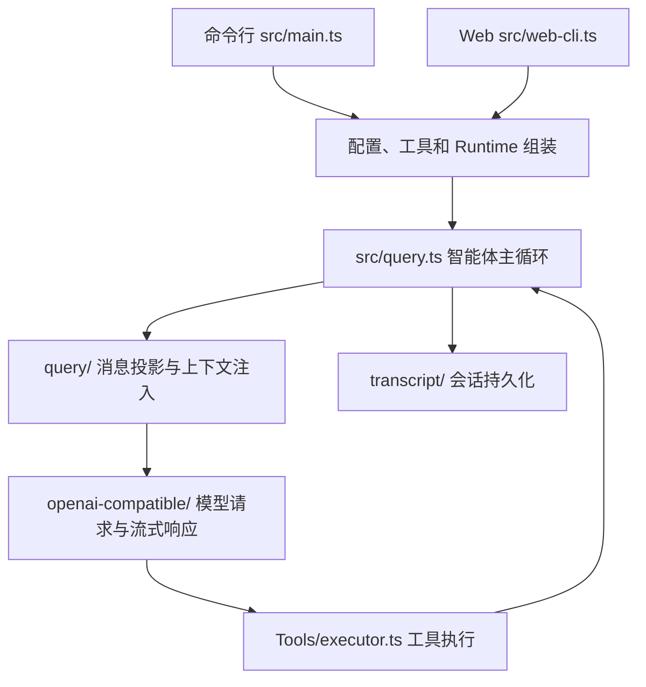

# OpenCat 项目导航

OpenCat 是一个 TypeScript 编码智能体。回顾项目时，先确定要修改的功能，再从下面的入口读起。本文描述当前代码，目录名称以实际文件为准。

## 一次任务如何执行

主循环按轮执行：先接收子智能体消息，再投影历史消息、按需压缩，最后注入运行时上下文，向模型请求响应并执行工具。如果模型不再请求工具，本次查询结束。取消、记忆提取和运行事件也由这个流程协调。

`State` 保存业务数据，例如历史消息、摘要、计划和后台任务；`Runtime` 保存当前执行依赖，例如配置、模型客户端、工具和 MCP 连接。恢复会话时，通过 transcript 重建 State，再重新组装 Runtime。Web 的连接状态和审批队列不写入 State。

## 改功能，从哪里开始

| 想修改什么 | 首先阅读 | 继续阅读 / 验证 |
| --- | --- | --- |
| 命令行启动、交互 | [src/main.ts](src/main.ts)、[src/cli.ts](src/cli.ts) | [配置文档](docs/configuration.md) |
| Web 启动、路由、会话、页面 | [Web 模块导航](src/interfaces/web/README.md) | `tests/web-cli.test.ts` |
| SWE 看板路由与页面 | [看板模块导航](src/interfaces/evaluation/README.md) | `tests/evaluation-dashboard.test.ts` |
| 评测指标、历史运行、数据集与会话回顾 | [评测服务导航](src/evaluation/README.md) | [评测导航](docs/evaluation-navigation.md) |
| 智能体每轮执行、工具调用顺序 | [src/query.ts](src/query.ts) | [Query 模块导航](src/query/README.md)、`tests/query-*.test.ts` |
| 每轮上下文准备、投影与压缩的先后顺序 | [src/query/turn-context.ts](src/query/turn-context.ts) | `npm run test:query` |
| 模型回合、工具批次与查询收尾 | [src/query/assistant-turn.ts](src/query/assistant-turn.ts)、[src/query/tool-execution.ts](src/query/tool-execution.ts)、[src/query/lifecycle.ts](src/query/lifecycle.ts) | [Query 模块导航](src/query/README.md) |
| 历史消息如何变成模型输入 | [src/query/messages.ts](src/query/messages.ts) | [消息投影](docs/projection.md)、`tests/query-history-snip.test.ts` |
| 记忆、技能、计划如何进入上下文 | [src/query/request-context.ts](src/query/request-context.ts)、[src/query/runtime-context.ts](src/query/runtime-context.ts) | [上下文注入](docs/context-injection.md) |
| 上下文压缩、压缩后的信息恢复 | [压缩模块导航](src/auto-compress/README.md) | [压缩文档](docs/compression.md) |
| 长期记忆写入、召回与 Dream 整理 | [记忆模块导航](src/Memory/README.md) | [长期记忆](docs/long-term-memory.md)、`tests/long-term-memory.test.ts` |
| 会话摘要 | [src/session-memory/index.ts](src/session-memory/index.ts) | `tests/session-memory-token-estimation.test.ts` |
| 添加工具、权限、并发执行 | [工具模块导航](src/Tools/README.md) | [工具文档](docs/tools.md)、`tests/tool-executor.test.ts` |
| 子智能体、消息、隔离工作区 | [src/Tools/Agent/runner.ts](src/Tools/Agent/runner.ts) | [多智能体文档](docs/agent.md)、`tests/agent-tool.test.ts` |
| 技能发现与执行 | [src/Tools/utils/discoverSkillsForReadPath.ts](src/Tools/utils/discoverSkillsForReadPath.ts)、[src/Tools/ReadSkill/ReadSkill.ts](src/Tools/ReadSkill/ReadSkill.ts) | [技能文档](docs/skill.md) |
| 模型接口、流式解析、错误信息 | [模型模块导航](src/openai-compatible/README.md) | [模型配置](docs/model-config.md)、`tests/openai-compatible-provider.test.ts` |
| MCP 外部工具 | [src/mcp/config.ts](src/mcp/config.ts) | [MCP 文档](docs/mcp.md)、`tests/mcp-*.test.ts` |
| 会话恢复、工具结果、补丁存档 | [持久化导航](docs/persistence.md) | `tests/session-transcript.test.ts`、`tests/tool-result-persistence.test.ts` |
| SWE 评测 | [评测导航](docs/evaluation-navigation.md) | [评测文档](docs/eval.md) |
| YAML 配置字段与默认值 | [src/config/schema.ts](src/config/schema.ts) | [src/config/load-config.ts](src/config/load-config.ts)、[示例配置](config/example.yaml) |

## 目录边界

| 目录 | 职责 |
| --- | --- |
| `src/interfaces/web/` | HTTP 与浏览器交互，依赖核心服务；核心服务不依赖 Web |
| `src/interfaces/evaluation/` | 评测看板的 HTTP、页面和启动配置，依赖评测服务 |
| `src/evaluation/` | 评测产物读取、指标计算、历史结果合并与工作区服务 |
| `src/query/`、`src/query.ts` | 智能体流程编排与模型输入组装 |
| `src/Tools/` | 工具协议、执行器、具体工具；Agent 工具当前也承载子智能体运行 |
| `src/Memory/` | 文件型长期记忆与仍被引用的旧记忆接口 |
| `src/auto-compress/`、`src/session-memory/` | 历史压缩、摘要生成与恢复 |
| `src/openai-compatible/`、`src/mcp/` | 外部模型与外部工具协议适配 |
| `src/transcript/`、`src/tool-results/`、`src/plan/`、`src/workspace/` | 各类状态和产物的持久化，详见持久化导航 |
| `src/swe/`、`scripts/` | 底层评测工作区管理、评测运行与维护脚本 |
| `src/types/`、`src/config/`、`src/telemetry/` | 核心契约、配置、运行观测 |

`dist/` 是构建输出，`node_modules/` 是依赖，`.opencat/` 是本地配置和运行数据。阅读和修改业务代码从 `src/` 开始，不手工编辑构建输出。

## 当前实现、兼容实现与实验代码

- 当前主循环的长期记忆使用 `Memory/file-memory.ts`，由 `query/long-term-memory.ts` 调度；`MemorySave` 写入文件记忆信号。
- `Memory/Memory.ts`、`Embedding/`、`VectorStore/`、`LLM/` 与 `Tools/MemorySearch/` 属于旧检索方案。Runtime 类型、配置适配和部分测试仍引用它们，迁移前不能直接删除。`MemorySearch` 不在默认工具注册表中。没有调用方的旧 `HistoryStore/` 和 `promptCN.ts` 已删除。
- 没有独立的 `src/Skills/` 目录；技能发现和执行在 Tools 内。
- 根目录 `codex/` 是本地参考克隆，已被 Git 忽略；[Codex 工程分析](docs/codex-context-engineering.md) 的源码链接指向固定版本的 GitHub 文件。

## 维护约定

变量、函数、状态归属及运行生命周期的审查结果见 [代码逻辑与冗余审查](docs/code-logic-review.md)。未使用声明和无效字段已清理；该文同时记录保留字段的原因与尚未修复的 Web 生命周期问题。

1. 一个模块围绕一项职责组织。入口负责配置与依赖组装，路由负责协议转换，核心服务负责业务逻辑。
2. 新模块使用小写目录名；现有 `Tools/`、`Memory/` 暂保留，避免大小写迁移引入跨平台路径问题。
3. 注释解释顺序约束、状态归属、兼容原因和资源生命周期，不重复函数名或逐行翻译代码。
4. 调整入口、模块归属或默认工具时，同步更新本文及对应模块 README。精确行数和默认值优先查源码，避免在导航中复制易过期的信息。
5. 先运行 `npm run check` 与相关测试；涉及入口或依赖组装时，再运行 `npm run build`。回归测试使用本地替身，真实模型实验在 `scripts/smoke-*-real.ts` 中，需另行配置。
